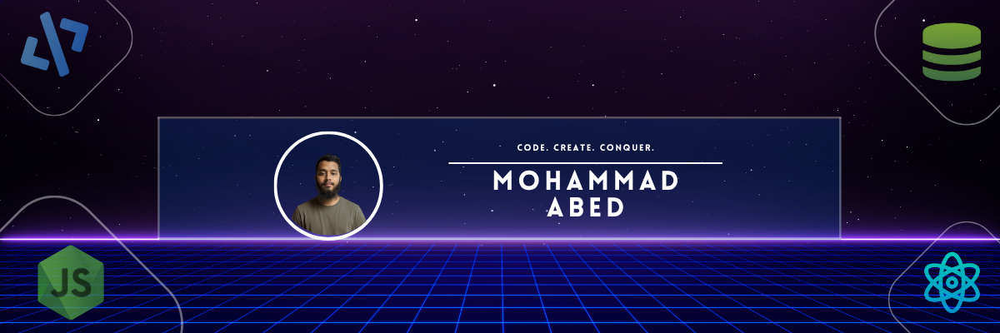

 

<!--- title --->

  <ul align="center">
    
<h1 style="display: inline-block">Hi 👋, I'm Mohammad Abed</h1>

    
  </ul>

 

<!--- about --->
- 👋 Hi, I’m **[@the-abed](https://github.com/the-abed)**
- 🖥️ Working with **React.js, Next.js** for frontend development.
- 🗄️ Using **Node.js, Express.js, MongoDB** for backend.
- 🛠️ Learning **React Native**.
- 💬 Ask me about **Full-Stack (React, Node, Express, MongoDB)**.
- 📝 I write articles on **[LinkedIn](https://www.linkedin.com/in/mohammad-abed-477100386/)**
- 📫 Reach me: **[Email](mailto:mohammadabed1283@gmail.com)**

 

<!--- socials --->
## <b> FOLLOW ME ON SOCIALS:</b>

  

    
    
    
  

 

<h2>💡 Tech Stack</h2>

<table width="100%" border="0">
  <tr>
    <td><strong>Frontend :</strong></td>
    <td>
      
      
      
      
      
      
    </td>
  </tr>
  <tr>
    <td><strong>Backend & Database :</strong></td>
    <td>
      
      
      
      
    </td>
  </tr>
  <tr>
    <td><strong>Deployments :</strong></td>
    <td>
      
      
      
      
    </td>
  </tr>
  <tr>
    <td><strong>Tools :</strong></td>
    <td>
      
      
      
      
      
    </td>
  </tr>
</table>

 

<!--- contributions --->
<!--- github stats --->
## 📊 GitHub Stats

| GitHub Stats | Streak Stats | Top Languages |
|--------------|--------------|----------------|
|  |  |  |

 

<!--- contributions --->
### 📈 Contribution Activity Graph  

  

 

<!--- pinned repos --->
## 📌 Pinned Projects

| UrbanPulse | PawMart Client |
|------------|---------------|
|  |  |

| Skill Swap | English Janala |
|------------|---------------|
|  |  |

| Hero.io | Payoo MFS Bank |
|---------|---------------|
|  |  |

 

<!--- profile views --->

 
   

